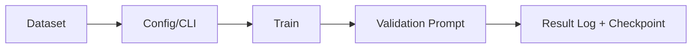

# 레시피

검증된 훈련/추론 세팅 모음. 실험을 거쳐 **재현 가능**하게 정리합니다.

!!! tip "레시피 vs 실험"
    **실험**: 시행착오 과정 전체 기록 (실패 포함)  
    **레시피**: 실험에서 확인된 **좋은 세팅**만 요약

## 훈련 레시피



### 1) SDXL 캐릭터 LoRA (kohya, RTX 3050 8GB 시작점)

**대상**: 캐릭터 LoRA  
**모델**: SDXL Base  
**도구**: kohya (`sd-scripts`)  
**하드웨어**: RTX 3050 8GB (Windows)

#### 권장 시작값

| 항목 | 값 |
|---|---|
| LoRA rank/alpha | `16 / 8` |
| batch size | `1` |
| lr | `1e-4` |
| optimizer | `AdamW` |
| precision | `bf16` 또는 `fp16` |
| resolution | `1024` |

#### 실행 예시 (PowerShell)

```powershell
cd .\Reference\sd-scripts-0.10.1\sd-scripts-0.10.1

accelerate launch sdxl_train_network.py `
  --network_module=networks.lora `
  --network_dim=16 `
  --network_alpha=8 `
  --optimizer_type=AdamW `
  --learning_rate=1e-4 `
  --train_batch_size=1 `
  --resolution=1024,1024 `
  --mixed_precision=bf16 `
  --gradient_checkpointing `
  --output_dir=.\output\sdxl_lora_char
```

#### 이론 연결

- LoRA: [→ 이론/훈련/LoRA](../theory/training/lora.md)
- 목적함수: [→ 이론/훈련/목적함수](../theory/training/objectives.md)
- Optimizer: [→ 이론/옵티마이저/AdamW](../theory/optimizers/adamw.md)

### 2) FLUX 스타일 LoRA (diffusion-pipe, T4 시작점)

**대상**: 스타일 LoRA  
**모델**: FLUX.1-dev  
**도구**: diffusion-pipe  
**하드웨어**: Colab T4 16GB 시작점

#### 권장 시작값

| 항목 | 값 |
|---|---|
| LoRA rank | `16~32` |
| lr | `1e-4` |
| timestep sampling | `logit_normal` 또는 `sigmoid` |
| precision | `bf16` |

#### 설정 체크포인트

1. `timestep_sample_method`와 추론 shift를 함께 기록
2. 텍스트 캐시 사용 여부(`cache_text_embeddings`) 명시
3. 저장 포맷을 ComfyUI 호환 prefix로 검증

#### 이론 연결

- Flow Matching: [→ 이론/확산/Flow Matching](../theory/diffusion/flow-matching.md)
- 목적함수: [→ 이론/훈련/목적함수](../theory/training/objectives.md)

### 템플릿

```
## [모델] + [도구] + [방법]

**대상**: 캐릭터 LoRA / 스타일 LoRA / Full FT 등
**모델**: SDXL / Flux / ...
**도구**: kohya / diffusion-pipe / ...
**하드웨어**: RTX 3050 8GB / T4 16GB / ...

### 세팅

​```bash
# 전체 CLI 명령어
accelerate launch train_network.py \
  --network_module=networks.lora \
  --network_dim=16 \
  --network_alpha=8 \
  --optimizer_type=Prodigy \
  --learning_rate=1.0 \
  ...
​```

### 데이터셋
- 이미지 수: N장
- 해상도: 1024x1024
- 반복: 10
- 캡션: 방식

### 결과
- 훈련 시간: ~X분
- VRAM 사용: ~XGB
- 품질 평가: (샘플 이미지)

### 이론 연결
- 옵티마이저 선택 이유: [→ 이론/옵티마이저/Prodigy](../theory/optimizers/prodigy.md)
- LoRA rank 선택 이유: [→ 이론/훈련이론/LoRA](../theory/training/lora.md)
```

## 추론 레시피

### 1) SDXL 범용 추론 (ComfyUI)

| 항목 | 권장 시작값 |
|---|---|
| sampler | `dpmpp_2m` |
| scheduler | `karras` |
| steps | `24~30` |
| cfg | `5.0~7.0` |
| denoise | `1.0` |

### 2) Anima 추론 (ComfyUI)

| 항목 | 권장 시작값 |
|---|---|
| sampler | `dpmpp_2m_sde` 또는 `euler` |
| scheduler | `karras` |
| steps | `20~28` |
| cfg | `3.5~6.0` |
| shift | 모델 기본값 유지(Anima 계열) |

### 3) 샘플러 비교 실험 템플릿

동일 조건 고정:
- prompt / negative prompt
- seed
- width / height
- model / LoRA weight

변수:
- sampler만 교체 (`euler`, `dpmpp_2m`, `dpmpp_sde`)
- scheduler만 교체 (`karras`, `normal`, `exponential`)

평가:
- 구조 보존(형태)
- 디테일(텍스처)
- 색 안정성
- 재현성(동일 seed)

관련 이론:
- [→ 이론/샘플러 개요](../theory/samplers/index.md)
- [→ 도구/ComfyUI/샘플러 구현](../tools/comfyui/samplers.md)
