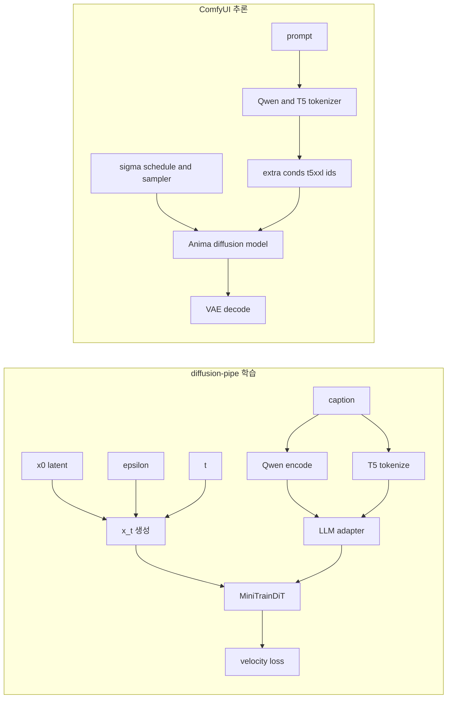

# Anima — Cosmos-Predict2 + LLM Adapter

> CircleStone Labs × Comfy Org · 기반: NVIDIA Cosmos-Predict2-2B

<span class="version-badge">Preview</span>
<span class="version-badge">기준: diffusion-pipe 우선</span>

## 1) 모델 카드

| 모델 | HuggingFace |
|---|---|
| **Anima (Preview)** | [circlestone-labs/Anima](https://huggingface.co/circlestone-labs/Anima) |
| Cosmos-Predict2-2B (Base) | [nvidia/Cosmos-Predict2-2B-Text2Image](https://huggingface.co/nvidia/Cosmos-Predict2-2B-Text2Image) |
| Cosmos-Predict2-14B | [nvidia/Cosmos-Predict2-14B-Text2Image](https://huggingface.co/nvidia/Cosmos-Predict2-14B-Text2Image) |

## 2) 핵심 요약

1. Anima는 Cosmos-Predict2 계열 DiT에 `LLM Adapter`를 결합한 구조입니다.
2. 학습 기준 동작은 `diffusion-pipe` 구현을 우선 참조하는 것이 안전합니다.
3. 추론 런타임은 ComfyUI가 사실상 표준이며, 저장 포맷 prefix 호환이 중요합니다.

## 3) 수학적 골격

Flow Matching 경로:

\[
x_t=(1-t)x_0+t\epsilon,\quad t\in[0,1]
\]

Anima 학습 타깃(velocity):

\[
v^*=\epsilon-x_0,\quad
\mathcal{L}=\|v_\theta(x_t,t,c)-(\epsilon-x_0)\|_2^2
\]

Anima의 특징은 `c`(조건) 구성에 있습니다:
- Qwen 임베딩(`cross_attn`) + T5 token ID(`t5_ids`)를 함께 사용
- LLM Adapter가 두 경로를 결합

## 4) 파이프라인 구조 (학습 vs 추론)



## 5) 코드 맵 (핵심 경로)

| 구분 | 주요 파일/함수 | 의미 |
|---|---|---|
| 학습 엔트리 | `diffusion-pipe/train.py` | `model_type='anima'` 라우팅 |
| 학습 파이프라인 | `models/cosmos_predict2.py` | 입력 준비, 텍스트 결합, param group 분리 |
| DiT 본체 | `models/cosmos_predict2_modeling.py` | `MiniTrainDIT` + `LLMAdapter` |
| 추론 모델 감지 | `comfy/model_detection.py` | Anima 타입 판별, prefix 인식 |
| 추론 조건 처리 | `comfy/model_base.py` | `extra_conds` + `preprocess_text_embeds` |
| 추론 텍스트 인코더 | `comfy/text_encoders/anima.py` | Qwen/T5 동시 처리 |

## 6) Anima vs Base Cosmos

| 항목 | Base Cosmos-Predict2 | Anima |
|---|---|---|
| 백본 | DiT | DiT(동일 계열) + LLM Adapter 활용 강화 |
| 텍스트 경로 | Old T5-XXL 중심 | Qwen3-0.6B + T5 IDs 결합 |
| 도메인 | 물리/실사 계열 | 애니/일러스트 특화 |
| 확산 방식 | Flow Matching | Flow Matching |
| 상태 | 안정 릴리스 | Preview |

## 7) 주요 규약 (실전에서 자주 깨지는 부분)

| 항목 | 규약 | 실패 시 증상 |
|---|---|---|
| 토큰 길이 | 학습/추론 모두 길이 규약(예: 512) 정합 | shape mismatch |
| prefix | full model: `net.` / LoRA: `diffusion_model.` | ComfyUI 로드 실패 |
| timestep 정책 | 학습 샘플링과 추론 shift/scheduler 정합 | 디테일/구조 붕괴 |
| Adapter 학습률 | `llm_adapter_lr` 별도 관리 | 과적합 또는 미학습 |

## 8) 훈련 설정 예시 (diffusion-pipe)

```toml
[model]
type = "anima"
transformer_path = "/path/to/anima-preview.safetensors"
vae_path = "/path/to/qwen_image_vae.safetensors"
llm_path = "/path/to/qwen_3_06b_base.safetensors"
dtype = "bfloat16"
llm_adapter_lr = 0
```

권장:
- 소규모 데이터셋: `llm_adapter_lr=0`에서 시작
- 대규모/새 개념 주입: adapter LR을 별도로 천천히 상승

## 9) 추론 기본값(ComfyUI 관점)

| 항목 | 기본/관례 | 비고 |
|---|---|---|
| `sampling_settings.shift` | `3.0` | flow 계열 스케줄에 영향 |
| 지원 dtype | bf16/fp16/fp32 | VRAM/속도 트레이드오프 |
| 조건 전달 | `t5xxl_ids`, `t5xxl_weights` | extra cond 경로 |

## 10) Preview 주의사항

1. Preview 기반 LoRA는 최종 가중치와 비호환일 수 있습니다.
2. 공개 시 "Preview 전용" 태그를 명시하는 편이 안전합니다.
3. 재학습(또는 리베이스) 계획을 전제로 운영하는 것이 좋습니다.

## 11) 구현 체크리스트

1. Qwen 경로와 T5 ID 경로가 모두 forward에 전달되는가.
2. `x_t`/target($\epsilon-x_0$) 수식이 코드와 일치하는가.
3. `llm_adapter_lr`의 on/off를 실험 로그에 명시했는가.
4. 저장 직후 ComfyUI에서 round-trip 로드 테스트를 했는가.
