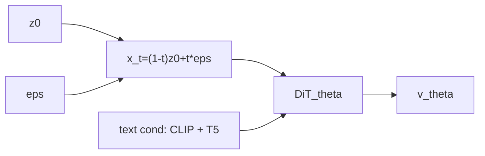

# FLUX.1 — DiT 기반 Flow Matching

> 백본: DiT (Dual-stream -> Single-stream) · 확산: Flow Matching · 유형: Image

## 0) 수학 프레임워크

| 기호 | 타입 | 상태 | 의미 |
|---|---|---|---|
| `z_0` | $z_0 \in \mathcal{X}$ | 임의 | clean latent |
| $\epsilon$ | $\epsilon \sim \mathcal{N}(0,I)$ | 임의 | 노이즈 |
| `t` | $t\in[0,1]$ | 임의 | 연속 시간 |
| `x_t` | $x_t \in \mathcal{X}$ | 결정 | 보간 상태 |
| $v_\theta$ | $\mathcal{X}\times[0,1]\times\mathcal{C}\to\mathcal{X}$ | 학습 대상 | 속도장 모델 |

\[
x_t=(1-t)z_0+t\epsilon,\qquad
\mathcal{L}_{FM}=\mathbb{E}\!\left[\|v_\theta(x_t,t,c)-(\epsilon-z_0)\|^2\right]
\]

## 1) 아키텍처 흐름

## 2) 블록 구조

| 구간 | 블록 수 | 특징 |
|---|---|---|
| Dual-stream | 19 | 이미지/텍스트 스트림을 분리 처리 후 교차 |
| Single-stream | 38 | concat 토큰으로 통합 self-attention |

## 3) 텍스트 조건

| 인코더 | 출력 | 역할 |
|---|---|---|
| CLIP-L | pooled vector ($\mathbb{R}^{768}$) | 전역 의미 |
| T5-XXL | token sequence ($\mathbb{R}^{L\times4096}$) | 세부 서술 |

## 4) timestep 샘플링 전략

| 전략 | 대표 플래그 | 수식 |
|---|---|---|
| Sigmoid | `timestep_sampling=sigmoid` | $t=\sigma(s z),\ z\sim\mathcal{N}(0,1)$ |
| Logit-Normal | `timestep_sampling=logit_normal` | $t=\sigma(\mu+s z)$ |
| Shift | `discrete_flow_shift=s` | $t'=\frac{s t}{1+(s-1)t}$ |

## 5) 실무 체크리스트

1. 학습 target을 $\epsilon-z_0$로 고정했는가.
2. 학습의 timestep 분포와 추론 shift/scheduler를 함께 기록했는가.
3. CLIP/T5 두 조건 경로가 모두 forward에 연결되는가.
