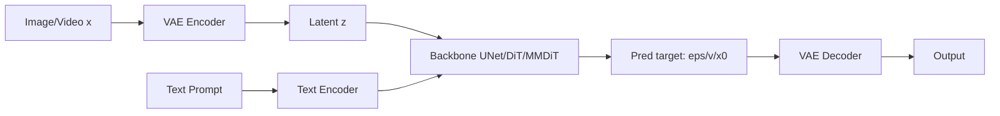

# 아키텍처

모델을 구성하는 핵심 부품의 수학적 구조.

## 1) 컴포넌트별 역할

| 컴포넌트 | 입력 -> 출력 | 핵심 역할 | 대표 모델 |
|---|---|---|---|
| VAE | pixel <-> latent | 고차원 공간 압축/복원 | SD/SDXL/Flux/Wan |
| Backbone | `z_t, t, cond -> target` | 노이즈 제거/속도장 추정 | UNet, DiT, MMDiT |
| Attention | token 간 상호작용 | 전역 문맥 결합 | 전 모델 공통 |
| Text Encoder | prompt -> 임베딩 | 조건 정보 표현 | CLIP, T5, Qwen |

## 2) Backbone 패밀리 비교

| 패밀리 | 구조 특징 | 장점 | 주의점 |
|---|---|---|---|
| UNet | CNN 기반 다중 해상도 skip | 안정적, 검증됨 | 장거리 의존성 확장 비용 |
| DiT | patch/token transformer | 대규모 확장성 | 메모리/연산량 큼 |
| MMDiT | 이미지/텍스트 joint attention | 멀티모달 결합 강함 | 설계 복잡도 상승 |

## 3) 수학 최소식

확산/flow 계열의 공통 추상:

\[
\hat{y}_\theta = F_\theta(z_t,t,c)
\]

여기서 $\hat{y}_\theta$는 모델 파라미터화에 따라
$\epsilon_\theta$, $v_\theta$, $x_{0,\theta}$ 중 하나가 됩니다.

## 4) 읽기 순서

1. [확산 수학](../diffusion/index.md)에서 `z_t`와 target 정의 확인
2. 모델 페이지에서 Backbone 선택 이유 확인  
   SD 계열: [SD 1.x](../../models/sd1x_arch.md), [SDXL](../../models/sdxl_arch.md)  
   DiT 계열: [SD3](../../models/sd3_arch.md), [FLUX](../../models/flux_arch.md), [Wan](../../models/wan_arch.md)
3. 도구 페이지에서 실제 코드 구현 확인  
   [ComfyUI](../../tools/comfyui/index.md), [kohya](../../tools/kohya/index.md), [diffusion-pipe](../../tools/diffusion-pipe/index.md)

## 5) 구현 체크리스트

1. VAE scale/shift 규약이 학습/추론에서 일치하는가.
2. text encoder 출력 차원과 backbone cross-attn 입력 차원이 맞는가.
3. timestep embedding 정의(정수/연속, sigma/t)가 모델 가정과 일치하는가.
4. target 파라미터화(`epsilon/v/x0`)와 loss 정의가 정확히 연결되는가.
