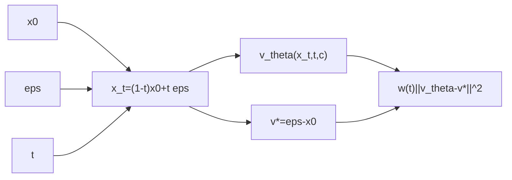

# Flow Matching - 시간 샘플링과 가중치

Flow Matching(FM)은 $x_0$와 $\epsilon$ 사이의 연속 경로에서
속도장 $v_\theta$를 맞추는 훈련 수학입니다.

## 0) 프레임워크 (Top-Down)

| 기호 | 타입/공간 | 상태 | 의미 |
|---|---|---|---|
| $x_0$ | $x_0\in\mathcal{X}$ | 임의 | 데이터 샘플 |
| $\epsilon$ | $\epsilon\sim\mathcal{N}(0,I)$ | 임의 | 기준 노이즈 |
| $t$ | $t\in(0,1)$ | 임의 | 연속 시간 |
| $c$ | $c\in\mathcal{C}$ | 고정 또는 임의 | 조건 입력 |
| $x_t$ | $x_t\in\mathcal{X}$ | $x_0,\epsilon,t$ 고정 후 결정 | 중간 상태 |
| $v_\theta$ | $v_\theta:\mathcal{X}\times(0,1)\times\mathcal{C}\to\mathcal{X}$ | 학습 대상 | 예측 속도장 |
| $w$ | $w:(0,1)\to\mathbb{R}_{\ge 0}$ | 설계값 | 시간 가중치 |

## 1) 기본 수식

경로:

\[
x_t=(1-t)x_0+t\epsilon
\]

정답 속도:

\[
v^*=\frac{d x_t}{dt}=\epsilon-x_0
\]

학습 손실:

\[
\mathcal{L}_{FM}=
\mathbb{E}_{x_0,\epsilon,t}
\left[
  w(t)\,\|v_\theta(x_t,t,c)-(\epsilon-x_0)\|_2^2
\right]
\]

## 2) 제약을 단계적으로 적용

1. $t\in(0,1)$
   이유: 경계에서 미분/수치 불안정을 피합니다.
2. $x_t$ 정의를 학습/추론에서 동일하게 유지
   이유: 시간 좌표 계약이 달라지면 품질이 급락합니다.
3. $p(t)$와 $w(t)$를 함께 설계
   이유: 둘 다 timestep 예산 배분을 결정합니다.

## 3) 시간 분포 전략

### 3-1) Uniform

\[
t\sim\mathcal{U}(0,1)
\]

### 3-2) Sigmoid 샘플링

\[
z\sim\mathcal{N}(0,1),\quad t=\sigma(s z)
\]

### 3-3) Logit-Normal 샘플링

\[
z\sim\mathcal{N}(0,1),\quad t=\sigma(\mu+s z)
\]

\[
p(t)\propto
\frac{1}{t(1-t)}
\exp\left(-\frac{(\operatorname{logit}(t)-\mu)^2}{2s^2}\right)
\]

### 3-4) Shift 재매개화

\[
t'=\frac{s\cdot t}{1+(s-1)t},\quad s>0
\]

| 조건 | 의미 |
|---|---|
| $s>1$ | 고노이즈 쪽 비중 증가 |
| $s<1$ | 저노이즈 쪽 비중 증가 |

## 4) SNR 관점

\[
\operatorname{SNR}_{FM}(t)=\left(\frac{1-t}{t}\right)^2
\]

$t=0.5$에서 SNR=1이고, 양끝으로 갈수록 불균형이 커집니다.
그래서 중앙 집중 분포가 실무에서 자주 유리합니다.

## 5) 구체 예시 (원소 나열)

$x_0=(1,0)$, $\epsilon=(0,2)$, $t=0.25$이면

\[
x_t=0.75(1,0)+0.25(0,2)=(0.75,0.5)
\]

\[
v^*=(0,2)-(1,0)=(-1,2)
\]

즉 이 샘플에서 모델은 $x_t=(0.75,0.5)$를 보고 $(-1,2)$를 맞추도록 학습합니다.

## 6) 구현 체크리스트

1. $x_t$, target, shift 규칙이 학습/추론에서 동일한가.
2. $p(t)$와 $w(t)$가 같은 구간을 과도하게 중복 강조하지 않는가.
3. 배치 차원 브로드캐스팅(`B` vs `B,1,1,1`)이 일관적인가.
