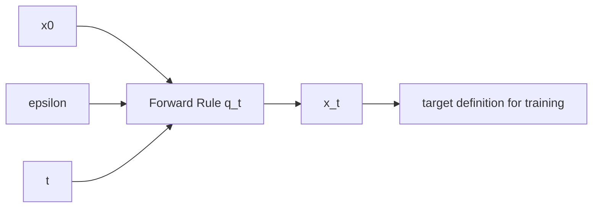

# 정방향 확산 (Forward Process)

정방향 확산은 $x_0$를 점진적으로 노이즈화해 $x_t$를 만드는 규칙입니다.
이 규칙이 훈련 target과 추론 역적분의 기준 좌표계를 동시에 정합니다.

## 0) 프레임워크 (Top-Down)

| 기호 | 타입/공간 | 상태 | 의미 |
|---|---|---|---|
| $\mathcal{X}$ | 상태공간(예: latent space) | 고정 | 샘플 공간 |
| $x_0$ | $x_0\in\mathcal{X}$ | 임의 | 원본 데이터 |
| $\epsilon$ | $\epsilon\sim\mathcal{N}(0,I)$ | 임의 | 가우시안 노이즈 |
| $t$ | $t\in\{1,\dots,T\}$ 또는 $t\in[0,1]$ | 임의 | 시간 인덱스 |
| $x_t$ | $x_t\in\mathcal{X}$ | $x_0,\epsilon,t$ 고정 후 결정 | 노이즈 섞인 상태 |
| $q_t$ | 확률커널 $q_t:\mathcal{X}\to\mathcal{P}(\mathcal{X})$ | 고정 | 정방향 전이 규칙 |

## 1) DDPM 이산 정방향

$T$ step 마르코프 체인:

\[
q(x_{1:T}|x_0)=\prod_{t=1}^{T} q(x_t|x_{t-1}),\quad
q(x_t|x_{t-1})=\mathcal{N}\!\left(\sqrt{1-\beta_t}\,x_{t-1},\beta_t I\right)
\]

누적 계수:

\[
\alpha_t:=1-\beta_t,\quad
\bar{\alpha}_t:=\prod_{s=1}^{t}\alpha_s
\]

임의 $t$에서 직접 샘플 가능한 닫힌형:

\[
x_t=\sqrt{\bar{\alpha}_t}\,x_0+\sqrt{1-\bar{\alpha}_t}\,\epsilon
\]

### 왜 이 제약이 필요한가

1. $0<\beta_t<1$  
   의미: 분산이 양수이고 전이가 유효한 가우시안이 됩니다.
2. $\bar{\alpha}_t$ 단조 감소  
   의미: 시간이 갈수록 신호 비율이 줄어듭니다.
3. $t=T$에서 고노이즈 상태 근사  
   의미: 역과정 시작 분포를 단순화할 수 있습니다.

## 2) 연속 시간 VP-SDE

이산 과정을 연속으로 보면:

\[
dx=f(x,t)\,dt+g(t)\,dW_t
\]

VP-SDE 대표형:

\[
dx=-\frac{\beta(t)}{2}x\,dt+\sqrt{\beta(t)}\,dW_t
\]

- $f(x,t)=-\beta(t)x/2$: 신호 감쇠 drift  
- $g(t)=\sqrt{\beta(t)}$: 노이즈 주입 diffusion

## 3) Flow Matching 정방향

FM 계열은 직선 보간을 사용:

\[
x_t=(1-t)x_0+t\epsilon,\quad t\in[0,1]
\]

속도장은 상수:

\[
v^*=\frac{d x_t}{dt}=\epsilon-x_0
\]

경계가 명확합니다.

| 조건 | 결과 |
|---|---|
| $t=0$ | $x_t=x_0$ |
| $t=1$ | $x_t=\epsilon$ |

## 4) DDPM vs FM 분기 조건

| 구분 | DDPM/VP | Flow Matching |
|---|---|---|
| 시간축 | 이산 또는 SDE | 연속 ODE/flow |
| 경로 | 곡선(variance preserving) | 직선 |
| target 대표 | $\epsilon$, $v$ | velocity $\epsilon-x_0$ |
| 추론 스텝 경향 | 상대적으로 많음 | 상대적으로 적음 |

## 5) SNR 관점

VP:

\[
\operatorname{SNR}_{VP}(t)=\frac{\bar{\alpha}_t}{1-\bar{\alpha}_t}
\]

FM:

\[
\operatorname{SNR}_{FM}(t)=\left(\frac{1-t}{t}\right)^2
\]

$SNR$은 timestep 가중치 설계(예: Min-SNR)와 직결됩니다.

## 6) 구체 예시 (원소 나열)

$x_0=(1,0)$, $\epsilon=(0,2)$라고 두면:

1. DDPM ($\bar{\alpha}_t=0.81$)

\[
x_t=(0.9,\,0)+\sqrt{0.19}(0,2)=(0.9,\,0.8718\ldots)
\]

2. FM ($t=0.25$)

\[
x_t=0.75(1,0)+0.25(0,2)=(0.75,\,0.5)
\]

