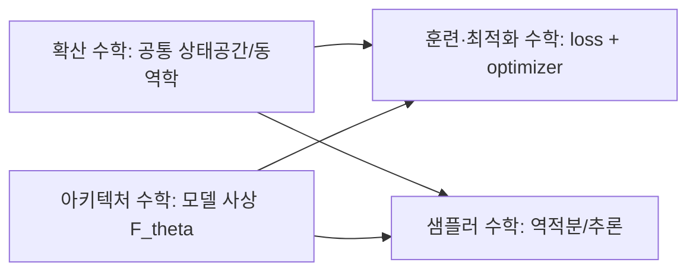

# 📐 이론 (Theory)

## 경계 규칙 (왜 이렇게 나누는가)

- **확산 수학**: 훈련/추론 공통으로 쓰는 기반 동역학(정방향/역방향, SDE/ODE, FM)
- **훈련·최적화 수학**: 목적함수 + optimizer + regularization
- **샘플러 수학**: 추론 시 역적분기(ODE/SDE stepper + scheduler)
- **아키텍처 수학**: UNet/DiT/MMDiT, VAE, attention, text encoder

즉, `확산 수학`은 훈련/추론 둘 다 포함하는 상위 계층이고,
`훈련·최적화`와 `샘플러`는 적용 단계별 하위 계층입니다.

## 섹션 바로가기

1. [확산 수학](diffusion/index.md)
2. [훈련·최적화 수학](training/index.md)
3. [샘플러](samplers/index.md)
4. [아키텍처](architecture/index.md)
