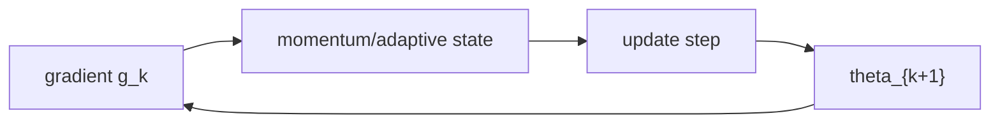
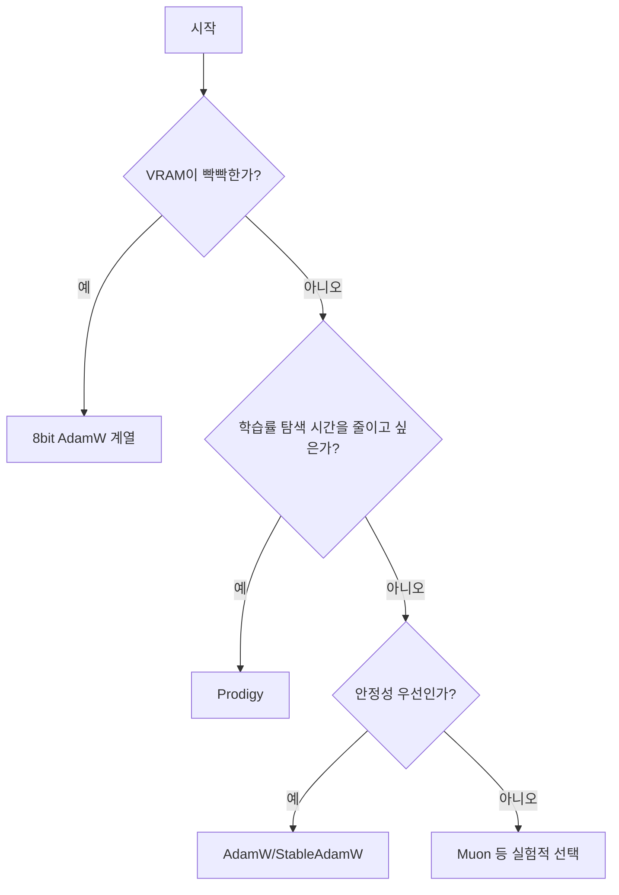

# 옵티마이저

확산 모델 훈련에서 옵티마이저는
`수렴 속도`, `안정성`, `메모리`를 동시에 결정합니다.

## 1) 공통 최적화 틀

일반화된 목적:

\[
\min_\theta \ \mathbb{E}_{(x_0,\epsilon,t)}\!\left[w(t)\,\ell_\theta(x_t,t)\right]
\]

옵티마이저는 이 목적의 파라미터 갱신
$\theta_{k+1}=\Phi(\theta_k,g_k,\mathrm{state}_k)$를 정의합니다.

## 2) 비교 축

| 축 | 질문 | 영향 |
|---|---|---|
| 적응성 | per-parameter LR을 얼마나 강하게 조절하는가 | 불안정/희소 gradient 대응 |
| 메모리 | optimizer state가 파라미터 대비 얼마나 큰가 | VRAM 한계 |
| 수치 안정성 | 저정밀도(BF16/FP8/8bit)에서 안정적인가 | 대형 모델 학습 가능성 |
| 튜닝 난이도 | lr/beta/eps를 얼마나 손대야 하는가 | 실험 비용 |

## 3) 빠른 선택 가이드

## 4) 페이지 맵

| 옵티마이저 | 핵심 아이디어 | 추천 상황 | 상세 |
|---|---|---|---|
| AdamW | Decoupled weight decay + adaptive moment | 가장 범용적인 기본값 | [AdamW](adamw.md) |
| AdamW 8bit | state를 8bit 양자화 | VRAM 부족 환경 | [AdamW 8bit](adamw8bit.md) |
| AdamW 8bit Kahan | 8bit + Kahan 보정 | 8bit 누적 오차 민감할 때 | [AdamW 8bit Kahan](adamw8bitkahan.md) |
| AdamW (optimi) | 구현 최적화 변형 | throughput/엔진 적합성 | [AdamW (optimi)](adamw_optimi.md) |
| StableAdamW | 안정성 강화 AdamW | 난해한 데이터/고해상도 | [StableAdamW](stableadamw.md) |
| Prodigy | distance 기반 LR 자동 추정 | LR 탐색 비용 절감 | [Prodigy](prodigy.md) |
| Muon | 정규화/직교화 계열 실험적 접근 | 대형 네트워크 실험 | [Muon](muon.md) |

## 5) 실무 체크리스트

1. LoRA와 Full FT에서 LR 스케일을 분리했는가.
2. 저정밀도(BF16/FP8/8bit)에서 loss spike를 모니터링하는가.
3. `weight_decay`를 텍스트 인코더/adapter에 동일 적용하지 않는가.
4. optimizer 변경 시 동일 seed/동일 배치로 A/B 비교하는가.

