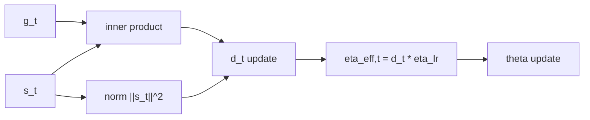

# Prodigy — Adaptive Learning Rate Estimation

> 분류: D-Adaptation 계열 · sd-scripts ✓ · diffusion-pipe ✓

## 0) 프레임워크 (Top-Down)

| 기호 | 타입/공간 | 상태 | 의미 |
|---|---|---|---|
| $\theta_t$ | $\theta_t \in \mathbb{R}^d$ | step마다 갱신 | 파라미터 |
| `g_t` | $g_t=\nabla_\theta \mathcal{L}(\theta_t)\in\mathbb{R}^d$ | 계산값 | gradient |
| `s_t` | $s_t\in\mathbb{R}^d$ | 누적 상태 | 누적 gradient 추정 |
| `d_t` | $d_t\in\mathbb{R}_{>0}$ | 학습 상태 | 거리 스케일 추정치 |
| $\eta_{\mathrm{lr}}$ | 양의 실수 | 하이퍼파라미터 | base learning-rate 계수 |

Prodigy의 핵심은 `d_t`를 online으로 추정해 **유효 LR**을 자동 스케일링하는 것입니다.

## 1) 핵심 업데이트

대표 형태(개념식):

\[
d_t
=
d_{t-1}
+
\eta_{\mathrm{lr}}
\cdot
\frac{|\langle g_t,s_t\rangle|}{d_{t-1}\|s_t\|_2^2}
\]

유효 학습률:

\[
\eta_{\mathrm{eff},t}=d_t\cdot\eta_{\mathrm{lr}}
\]

## 2) 제약을 단계적으로 적용

1. `d_{t-1}>0` 유지
   이유: 분모 안정성 및 업데이트 방향 일관성.
2. `\|s_t\|_2^2`가 너무 작을 때 보호항/클램프 적용
   이유: 초기 step 폭주 방지.
3. 필요 시 `growth_rate` 상한
   이유: `d_t` 급증을 제한해 훈련 초기 진동 완화.

## 3) 왜 필요한가 (직관)

전통적 방식은 `lr=1e-4`, `5e-5` 같은 그리드 탐색이 필요합니다.
Prodigy는 이 스케일 탐색을 `d_t` 추정으로 대체하려는 접근입니다.

## 4) 구체 예시 (원소 나열)

벡터공간을 명시:

\[
X=\mathbb{R}^2,\quad
g_1=(2,-1),\ g_2=(1,3),\quad
s_1=g_1,\ s_2=g_1+g_2=(3,2)
\]

스칼라 상태:

\[
d_0=1,\ \eta_{\mathrm{lr}}=1
\]

그러면 `t=1`에서

\[
d_1=1+\frac{|\langle g_1,s_1\rangle|}{1\cdot\|s_1\|_2^2}
=1+\frac{|2^2+(-1)^2|}{2^2+(-1)^2}=2
\]

즉 첫 step 유효 LR은 $\eta_{\mathrm{eff},1}=2$가 됩니다.
(실구현은 안정화 항/모멘텀 등이 추가됩니다.)

## 5) 의존성 그래프



## 6) 장단점

| 항목 | 장점 | 주의점 |
|---|---|---|
| LR 튜닝 비용 | 낮춤 | 초기 진동 가능 |
| 이식성 | 다양한 모델에 적용 가능 | 안정화 파라미터 관리 필요 |
| 실전성 | LoRA 실험 속도 향상 | 매우 작은 데이터셋에서 과적응 주의 |

## 7) 코드 매핑

```python
# sd-scripts
# --optimizer_type Prodigy --learning_rate 1.0
from prodigyopt import Prodigy
optimizer = Prodigy(params, lr=1.0, d_coef=1.0)

# diffusion-pipe (pytorch-optimizer)
from pytorch_optimizer import Prodigy
optimizer = Prodigy(params, lr=1.0)
```
