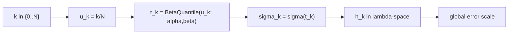

# Scheduler: beta

Beta scheduler는 Beta 분포의 역누적함수(quantile)를 이용해
원하는 구간에 step을 의도적으로 집중합니다.

## 0) 프레임워크 (Top-Down)

| 기호 | 타입(정의역 -> 공역) | 상태 | 의미 |
|---|---|---|---|
| `N` | $N\in\mathbb{N}$ | 고정 | 전체 step 수 |
| `S` | $\sym{Smap}{S}:\{0,\dots,N\}\to(0,\infty)$ | 설계 대상 | scheduler 사상 |
| `u_k` | $u_k=k/N\in[0,1]$ | 임의 -> 고정 | 균등 기준 격자 |
| $\alpha,\beta$ | 양의 실수 | 고정 하이퍼파라미터 | 집중 형태 제어 |
| `t_k` | $t_k\in[0,1]$ | $u_k,\alpha,\beta$ 고정 후 결정 | 왜곡된 시간 좌표 |
| $\sigma_k$ | $\sym{sigmak}{\sigma_k}=S(k)$ | 결정 | k번째 sigma |

핵심 사상:

\[
t_k=F^{-1}_{\mathrm{Beta}(\alpha,\beta)}(u_k),\quad
\sigma_k=\sigma(t_k)
\]

## 1) 제약을 단계적으로 적용

1. $\alpha>0,\beta>0$  
   이유: Beta 분포가 정의됩니다.
2. `u_k=k/N` 설정  
   이유: 왜곡 전 균등 기준을 고정합니다.
3. `t_k=F^{-1}(u_k)` 적용  
   이유: 특정 구간 밀집/희소를 제어합니다.
4. $\sigma_{k+1}\le\sigma_k$ 확인  
   이유: 역확산 순서를 보장합니다.

## 2) 조건 분기 (파라미터 해석)

| 조건 | 시간축 밀도 | 일반 경향 |
|---|---|---|
| $\alpha=\beta=1$ | 균등 | baseline |
| $\alpha<1,\beta>1$ | 초기 구간 집중 | 고노이즈 쪽 보강 |
| $\alpha>1,\beta<1$ | 후반 구간 집중 | 저노이즈 디테일 보강 |
| $\alpha>1,\beta>1$ | 중앙 집중 | 중간 구간 오차 완화 |

## 3) 오차 연결

\[
h_k:=|\lambda_{k+1}-\lambda_k|,\quad
\lambda_k:=\log\alpha_k-\log\sigma_k,\quad
\|e_{\mathrm{global}}\|\approx C\max_k h_k^p
\]

Beta scheduler는 `u_k -> t_k` 매핑을 통해 `h_k` 분포를 간접 제어합니다.

## 4) 구체 예시 (원소 나열)

\[
K=\{0,1,2,3,4\},\quad U=\left\{0,\frac14,\frac12,\frac34,1\right\}
\]

$(\alpha,\beta)=(2,5)$이면

\[
t_i=F^{-1}_{\mathrm{Beta}(2,5)}(U_i),\quad
S(i)=\sigma(t_i)
\]

즉,

\[
S(0)=\sigma(t_0),\ S(1)=\sigma(t_1),\ S(2)=\sigma(t_2),\ S(3)=\sigma(t_3),\ S(4)=\sigma(t_4)
\]

## 5) 의존성 그래프

## 6) Sampler 결합 관점

\[
x_{k+1}=A_kx_k+B_k\hat{x}_{0,k}+C_k(\mathrm{history})+D_k\xi_k
\]

동일 solver라도 Beta 파라미터가 바뀌면 체감 품질(구조/디테일 균형)이 달라집니다.
