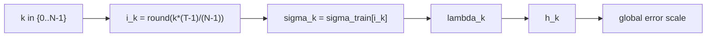

# Scheduler: ddim_uniform

`ddim_uniform`은 학습 시 사용한 이산 timestep ladder에서
균등 stride로 인덱스를 뽑아 sigma를 구성합니다.

## 0) 프레임워크 (Top-Down)

| 기호 | 타입(정의역 -> 공역) | 상태 | 의미 |
|---|---|---|---|
| `T` | $T\in\mathbb{N}$ | 고정 | 학습 timestep 개수 |
| `N` | $N\in\mathbb{N}$ | 고정 | 추론 step 개수 |
| $\Sigma_{\mathrm{train}}$ | $\{\sigma^{train}_0,\dots,\sigma^{train}_{T-1}\}$ | 고정 | 학습 sigma ladder |
| $i_k$ | $i_k\in\{0,\dots,T-1\}$ | $k$ 고정 후 결정 | 선택된 ladder index |
| `S` | $\sym{Smap}{S}:\{0,\dots,N-1\}\to(0,\infty)$ | 설계 대상 | scheduler 사상 |
| $\sigma_k$ | $\sym{sigmak}{\sigma_k}=S(k)$ | 결정 | k번째 sigma |

핵심 매핑:

\[
i_k=\operatorname{round}\!\left(k\cdot\frac{T-1}{N-1}\right),\quad
\sigma_k=\sigma^{train}_{i_k}
\]

## 1) 제약을 단계적으로 적용

1. $N\le T$ (보통)  
   이유: 추론 step이 학습 ladder 해상도를 초과하면 중복/보간 정책이 필요합니다.
2. $i_k$ 단조 증가 보장  
   이유: 역확산 순서 보존.
3. 필요 시 끝점 고정 (`i_0=0`, `i_{N-1}=T-1`)  
   이유: 시작/종료 노이즈 경계 일치.

## 2) 오차 연결

\[
h_k:=|\lambda_{k+1}-\lambda_k|,\quad
\lambda_k:=\log\alpha_k-\log\sigma_k,\quad
\|e_{\mathrm{global}}\|\approx C\max_k h_k^p
\]

이 방식은 $h_k$를 연속 함수가 아니라 이산 ladder stride로 결정합니다.

## 3) 경계 분기

| 조건 | 해석 | 결과 경향 |
|---|---|---|
| $N \ll T$ | 거친 stride | 빠르지만 디테일 손실 가능 |
| $N \approx T$ | 촘촘한 stride | 품질↑, 속도↓ |

## 4) 구체 예시 (원소 나열)

\[
T=10,\ N=4,\ K=\{0,1,2,3\}
\]

그러면

\[
i_0=0,\ i_1=3,\ i_2=6,\ i_3=9
\]

즉

\[
S(0)=\sigma^{train}_0,\ S(1)=\sigma^{train}_3,\ S(2)=\sigma^{train}_6,\ S(3)=\sigma^{train}_9
\]

## 5) 의존성 그래프

## 6) Sampler 결합 관점

\[
x_{k+1}=A_kx_k+B_k\hat{x}_{0,k}+C_k(\mathrm{history})+D_k\xi_k
\]

`ddim_uniform`은 구현 해석이 직관적이고 재현성이 높다는 장점이 있습니다.
