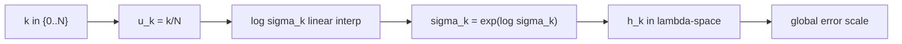

# Scheduler: exponential

Exponential scheduler는 $\log \sigma$를 선형 보간해서
배율 변화가 일정한 메쉬를 만듭니다.

## 0) 프레임워크 (Top-Down)

| 기호 | 타입(정의역 -> 공역) | 상태 | 의미 |
|---|---|---|---|
| `N` | $N\in\mathbb{N}$ | 고정 | 전체 step 수 |
| $\Sigma$ | $\Sigma=(0,\infty)$ | 고정 | sigma 공역 |
| `S` | $\sym{Smap}{S}:\{0,\dots,N\}\to\Sigma$ | 설계 대상 | scheduler 사상 |
| `u` | $u\in[0,1]$ | 임의 | 정규화 시간 |
| $\sigma_k$ | $\sym{sigmak}{\sigma_k}=S(k)$ | `S,k` 고정 후 결정 | k번째 sigma |

핵심 사상:

\[
\log \sigma(u)=(1-u)\log \sigma_{\max}+u\log \sigma_{\min}
\]

동치 형태:

\[
\sigma(u)=\sigma_{\max}^{1-u}\sigma_{\min}^{u}
\]

## 1) 제약을 단계적으로 적용

1. $\sigma_{\max}>\sigma_{\min}>0$  
   이유: 로그가 정의되고 경계가 확정됩니다.
2. `u_k=k/N`, $\sigma_k=\sigma(u_k)$  
   이유: 연속식을 이산 step에 매핑합니다.
3. $\sigma_{k+1}\le \sigma_k$ 확인  
   이유: 역확산 방향을 유지합니다.

## 2) 오차 연결

\[
h_k:=|\lambda_{k+1}-\lambda_k|,\quad
\lambda_k:=\log\alpha_k-\log\sigma_k,\quad
\|e_{\mathrm{global}}\|\approx C\max_k h_k^p
\]

`log-sigma` 공간이 균등하면 multi-step 계열에서 step ratio 변동이 완만해집니다.

## 3) 조건 분기

| 조건 | 의미 | 결과 경향 |
|---|---|---|
| $\sigma_{\max}/\sigma_{\min}$ 큼 | 동적 범위 큼 | 초반/후반 난이도 차이 증가 |
| `N` 큼 | 분할 촘촘 | 오차 감소, 시간 증가 |

## 4) 구체 예시 (원소 나열)

\[
K=\{0,1,2,3\},\quad U=\left\{0,\frac13,\frac23,1\right\}
\]

$(\sigma_{\max},\sigma_{\min})=(10,0.1)$이면

\[
S:K\to(0,\infty),\quad S(k)=10^{1-k/3}\cdot 0.1^{k/3}
\]

즉,

\[
S(0)=10,\ S(1)=10^{2/3}0.1^{1/3},\ S(2)=10^{1/3}0.1^{2/3},\ S(3)=0.1
\]

## 5) 의존성 그래프

## 6) Sampler 결합 관점

\[
x_{k+1}=A_kx_k+B_k\hat{x}_{0,k}+C_k(\mathrm{history})+D_k\xi_k
\]

같은 sampler라도 `S`가 바뀌면 `A_k,B_k,C_k,D_k`가 적용되는 노이즈 구간이 바뀝니다.
