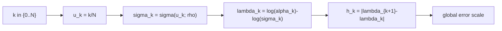

# Scheduler: karras

Karras scheduler는 solver 공식을 바꾸지 않고 `sigma` 격자만 재배치해서
오차가 쌓이는 구간(`h_k`)을 조정합니다.

## 0) 프레임워크 (Top-Down)

| 기호 | 타입(정의역 -> 공역) | 상태 | 의미 |
|---|---|---|---|
| `N` | $N \in \mathbb{N}$ | 고정 | 전체 step 수 |
| $\Sigma$ | $\Sigma=(0,\infty)$ | 고정 | sigma 공역 |
| `S` | $\sym{Smap}{S}:\{0,\dots,N\}\to\Sigma$ | 설계 대상 | scheduler 사상 |
| `k` | $k\in\{0,\dots,N\}$ | 임의 | step index |
| `u` | $u\in[0,1]$ | 임의 | 정규화된 시간 좌표 |
| $\rho$ | $\rho>0$ | 고정 하이퍼파라미터 | 메쉬 곡률 제어 |
| $\sigma_k$ | $\sym{sigmak}{\sigma_k}=S(k)$ | `S,k` 고정 후 결정 | k번째 sigma |

핵심 사상:

\[
\sigma(u)=
\left(
\sigma_{\max}^{1/\rho}
+
u\bigl(\sigma_{\min}^{1/\rho}-\sigma_{\max}^{1/\rho}\bigr)
\right)^\rho,\quad u\in[0,1]
\]

## 1) 제약을 단계적으로 적용

1. 경계 고정: $\sigma_{\max}>\sigma_{\min}>0$  
   이유: 역확산 시작/종료 노이즈 레벨을 명확히 고정해야 합니다.
2. 이산화: `u_k=k/N`, $\sigma_k=\sigma(u_k)$  
   이유: 연속 사상을 수치 적분 step으로 일관되게 샘플링합니다.
3. 단조성 확인: $\sigma_{k+1}\le \sigma_k$  
   이유: 고노이즈 -> 저노이즈 방향의 역적분을 보장합니다.

## 2) 오차와 직접 연결되는 양

\[
h_k:=|\lambda_{k+1}-\lambda_k|,\quad
\lambda_k:=\log\alpha_k-\log\sigma_k,\quad
\|e_{\mathrm{global}}\|\approx C\max_k h_k^p
\]

scheduler가 바꾸는 것은 결국 `h_k`의 분포입니다.

## 3) 조건 분기 (rho 값)

| 조건 | 해석 | 경향 |
|---|---|---|
| $\rho=1$ | 선형 보간과 유사 | 균등한 배분 |
| $\rho>1$ | 저노이즈 쪽 분해능 증가 | 디테일 복원 쪽 강화 |
| $0<\rho<1$ | 고노이즈 쪽 분해능 증가 | 구조 형성 쪽 강화 |

## 4) 구체 예시 (원소 나열)

\[
K=\{0,1,2,3,4\},\quad U=\left\{0,\frac14,\frac12,\frac34,1\right\}
\]

경계를 $\sigma_{\max}=14$, $\sigma_{\min}=0.1$, $\rho=7$로 두면

\[
S:K\to(0,\infty),\quad
S(k)=\sigma(k/4)
\]

즉,

\[
S(0)=\sigma(0),\ S(1)=\sigma(1/4),\ S(2)=\sigma(1/2),\ S(3)=\sigma(3/4),\ S(4)=\sigma(1)
\]

## 5) 의존성 그래프

## 6) Sampler 결합 관점

같은 solver라도 `S`가 바뀌면 각 step이 놓이는 구간이 달라져

\[
x_{k+1}=A_kx_k+B_k\hat{x}_{0,k}+C_k(\mathrm{history})+D_k\xi_k
\]

에서 계수(`A_k,B_k,C_k,D_k`)가 작동하는 regime이 달라집니다.
