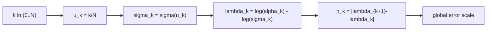

# Scheduler: kl_optimal

KL-optimal scheduler는 solver 자체를 바꾸지 않고,
`sigma` 격자($\sym{sigmak}{\sigma_0},\ldots,\sym{sigmak}{\sigma_N}$)를 재배치해서 오차가 쌓이는 구간을 조절합니다.

## 0) 프레임워크 (Top-Down)

| 기호 | 타입(정의역 -> 공역) | 상태 | 의미 |
|---|---|---|---|
| `N` | $N \in \mathbb{N}$ | 고정 | 전체 step 수 |
| $\Sigma$ | $\Sigma=(0,\infty)$ | 고정 | sigma의 공역 |
| `S` | $\sym{Smap}{S}:\{0,\dots,N\}\to\Sigma$ | 설계 대상 | scheduler 사상 |
| `k` | $k\in\{0,\dots,N\}$ | 임의 | step index |
| $\sigma_k$ | $\sym{sigmak}{\sigma_k}=S(k)$ | `S`와 `k` 고정 후 결정 | k번째 sigma |
| `u_k` | $u_k\in[0,1]$ | 임의 | 정규화된 index |

`kl_optimal`의 핵심 사상:

\[
\sigma(u)=\tan\!\left(u\arctan(\sigma_{\min})+(1-u)\arctan(\sigma_{\max})\right),\quad u\in[0,1]
\]

그리고 $\sigma_k=\sigma(u_k)$로 이산 격자를 만듭니다.

## 1) 구성 단계와 제약 (왜 필요한가)

1. 경계값 고정: $\sigma_{\max}>\sigma_{\min}>0$
   이유: 역적분 시작/종료 노이즈 레벨을 명확히 고정해야 합니다.
2. 정규화 인덱스 선택: `u_k=k/N`
   이유: 연속 사상 $\sigma(u)$를 이산 step으로 안정적으로 샘플링합니다.
3. 단조성 확인: $\sigma_{k+1}\le \sigma_k$
   이유: 역확산(고노이즈 -> 저노이즈) 방향을 보장합니다.

## 2) 오차와의 연결

solver 차수 `p`에서 전역 오차를 거칠게 보면:

\[
\|e_{\mathrm{global}}\|\approx C\max_k h_k^p,\quad h_k:=|\lambda_{k+1}-\lambda_k|,\quad \lambda:=\log\alpha-\log\sigma
\]

따라서 scheduler는 결국 `h_k` 분포를 바꾸는 장치입니다.

## 3) 경계 분기 (조건을 명확히)

| 조건 | 해석 | 결과 경향 |
|---|---|---|
| $u\to 0$ | 시작 구간(큰 sigma) | 구조(거친 형태) 안정화 영향 큼 |
| $u\to 1$ | 종료 구간(작은 sigma) | 디테일/텍스처 복원 영향 큼 |

KL-optimal은 보통 중간 구간의 오차 누적을 완화하려는 휴리스틱으로 사용됩니다.

## 4) 구체 예시 (원소 나열)

집합을 명시적으로 두면:

\[
K=\{0,1,2,3,4\},\quad U=\left\{0,\frac14,\frac12,\frac34,1\right\}
\]

경계값을 $\sigma_{\max}=14$, $\sigma_{\min}=0.1$로 두고
$f(u)=\tan(u\arctan(0.1)+(1-u)\arctan(14))$라 하면

\[
S:K\to(0,\infty),\quad S(k)=f(k/4)
\]

즉 원소 수준 매핑은:

\[
S(0)=f(0),\ S(1)=f(1/4),\ S(2)=f(1/2),\ S(3)=f(3/4),\ S(4)=f(1)
\]

## 5) 함수 의존성 그래프

## 6) Sampler 결합 관점

같은 `sample_*` solver라도 `S`가 바뀌면 step 위치가 바뀌므로,

\[
x_{k+1}=A_kx_k+B_k\hat{x}_{0,k}+C_k(\text{history})+D_k\xi_k
\]

에서 실질 계수(`A_k,B_k,C_k,D_k`)의 작동 구간이 달라집니다.
결과적으로 구조/디테일/안정성의 체감이 달라집니다.

