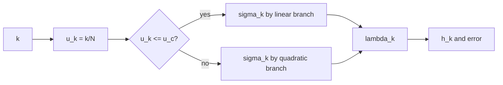

# Scheduler: linear_quadratic

`linear_quadratic`은 시간축을 두 구간으로 나눠
초반은 선형, 후반은 이차식으로 sigma를 배치하는 방식입니다.

## 0) 프레임워크 (Top-Down)

| 기호 | 타입(정의역 -> 공역) | 상태 | 의미 |
|---|---|---|---|
| `u` | $u\in[0,1]$ | 임의 | 정규화 시간 |
| `u_c` | $u_c\in(0,1)$ | 고정 하이퍼파라미터 | 분기 경계점 |
| `S` | $\sym{Smap}{S}:\{0,\dots,N\}\to(0,\infty)$ | 설계 대상 | scheduler 사상 |
| $\sigma_k$ | $\sym{sigmak}{\sigma_k}=S(k)$ | 결정 | k번째 sigma |

대표 정의(연속성 제약 포함):

\[
\sigma(u)=
\begin{cases}
a_0+a_1u, & 0\le u\le u_c \\
b_0+b_1u+b_2u^2, & u_c < u\le 1
\end{cases}
\]

계수는 보통 다음 조건으로 고정합니다.

\[
\sigma(0)=\sigma_{\max},\ 
\sigma(1)=\sigma_{\min},\ 
\sigma(u_c^-)=\sigma(u_c^+),\ 
\sigma'(u_c^-)=\sigma'(u_c^+)
\]

## 1) 제약을 단계적으로 적용

1. 경계값 고정: $\sigma_{\max}>\sigma_{\min}>0$  
   이유: 시작/종료 노이즈 레벨 정의.
2. 분기점 `u_c` 선택  
   이유: 구조 형성 구간과 디테일 구간을 분리 제어.
3. 연속/미분가능 조건 부여  
   이유: 분기점에서 step jump를 방지.
4. 단조성 확인 ($\sigma_{k+1}\le\sigma_k$)  
   이유: 역확산 방향 보장.

## 2) 조건 분기 (u_c)

| 조건 | 의미 | 결과 경향 |
|---|---|---|
| `u_c` 작음 | 후반(이차) 구간 길어짐 | 저노이즈 디테일 튜닝 비중 증가 |
| `u_c` 큼 | 초반(선형) 구간 길어짐 | 구조 안정화 비중 증가 |

## 3) 오차 연결

\[
h_k:=|\lambda_{k+1}-\lambda_k|,\quad
\lambda_k:=\log\alpha_k-\log\sigma_k,\quad
\|e_{\mathrm{global}}\|\approx C\max_k h_k^p
\]

구간별 곡률이 달라 `h_k` 분포를 의도적으로 비대칭 배치할 수 있습니다.

## 4) 구체 예시 (원소 나열)

\[
K=\{0,1,2,3,4\},\quad
U=\left\{0,\frac14,\frac12,\frac34,1\right\},\quad
u_c=\frac12
\]

그러면

\[
S(i)=\sigma(U_i),\quad
S(0)=\sigma(0),\ S(1)=\sigma(1/4),\ S(2)=\sigma(1/2),\ S(3)=\sigma(3/4),\ S(4)=\sigma(1)
\]

## 5) 의존성 그래프

## 6) Sampler 결합 관점

\[
x_{k+1}=A_kx_k+B_k\hat{x}_{0,k}+C_k(\mathrm{history})+D_k\xi_k
\]

분기형 스케줄러는 구간별로 다른 샘플링 성향을 내고 싶을 때 실무적으로 유용합니다.
