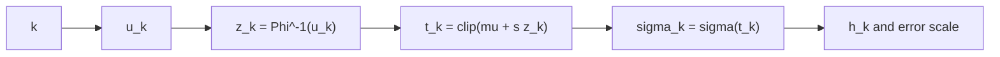

# Scheduler: normal

`normal` scheduler는 정규분포 기반 quantile을 이용해
중앙 또는 특정 구간에 step 밀도를 배치합니다.

## 0) 프레임워크 (Top-Down)

| 기호 | 타입(정의역 -> 공역) | 상태 | 의미 |
|---|---|---|---|
| `N` | $N\in\mathbb{N}$ | 고정 | 추론 step 수 |
| `u_k` | $u_k=k/N\in(0,1)$ | 임의 -> 고정 | 균등 기준 격자 |
| $\Phi^{-1}$ | $(0,1)\to\mathbb{R}$ | 고정 | 표준정규 quantile |
| $\mu,s$ | $\mu\in\mathbb{R}, s>0$ | 고정 하이퍼파라미터 | 중심/폭 제어 |
| `t_k` | $t_k\in[0,1]$ | 결정 | 왜곡된 시간 좌표 |
| `S` | $\sym{Smap}{S}:\{0,\dots,N\}\to(0,\infty)$ | 설계 대상 | scheduler 사상 |

대표식:

\[
z_k=\Phi^{-1}(u_k),\quad
t_k=\operatorname{clip}(\mu+s z_k,\ 0,\ 1),\quad
\sigma_k=\sigma(t_k)
\]

## 1) 제약을 단계적으로 적용

1. $u_k\in(0,1)$ 유지  
   이유: quantile의 양끝 발산을 피합니다.
2. `s>0` 고정  
   이유: 분포 폭(집중도)을 일관되게 정의합니다.
3. `clip` 적용 후 단조성 확인  
   이유: 경계에서 step이 눌리는 경우 순서가 흔들리지 않도록 보장합니다.

## 2) 조건 분기

| 조건 | 의미 | 경향 |
|---|---|---|
| `s` 작음 | 중앙 집중 | 중간 노이즈 구간 해상도 증가 |
| `s` 큼 | 양끝 포함 확대 | 전 구간 고르게 탐색 |
| $\mu>0.5$ | 후반 쏠림 | 저노이즈 디테일 강화 |
| $\mu<0.5$ | 초반 쏠림 | 고노이즈 구조 안정화 |

## 3) 오차 연결

\[
h_k:=|\lambda_{k+1}-\lambda_k|,\quad
\lambda_k:=\log\alpha_k-\log\sigma_k,\quad
\|e_{\mathrm{global}}\|\approx C\max_k h_k^p
\]

정규 quantile 왜곡은 `h_k`를 비선형적으로 재분배합니다.

## 4) 구체 예시 (원소 나열)

\[
K=\{0,1,2,3,4\},\quad
U=\left\{0.1,0.3,0.5,0.7,0.9\right\}
\]

$(\mu,s)=(0.5,0.2)$면

\[
t_i=\operatorname{clip}(0.5+0.2\Phi^{-1}(U_i),0,1),\quad
S(i)=\sigma(t_i)
\]

## 5) 의존성 그래프

## 6) Sampler 결합 관점

\[
x_{k+1}=A_kx_k+B_k\hat{x}_{0,k}+C_k(\mathrm{history})+D_k\xi_k
\]

같은 solver라도 $(\mu,s)$ 설정에 따라 체감 선명도와 안정성이 달라집니다.
