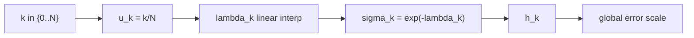

# Scheduler: sgm_uniform

`sgm_uniform`은 SGM 좌표(보통 $\lambda=-\log\sigma$)에서 균등 간격을 두는 방식입니다.
즉 `sigma` 자체가 아니라 로그 좌표를 균등화합니다.

## 0) 프레임워크 (Top-Down)

| 기호 | 타입(정의역 -> 공역) | 상태 | 의미 |
|---|---|---|---|
| `N` | $N\in\mathbb{N}$ | 고정 | 전체 step 수 |
| $\lambda$ | $\lambda\in\mathbb{R}$ | 좌표계 정의 | SGM 시간 좌표 |
| $\lambda_{\max},\lambda_{\min}$ | 실수, $\lambda_{\max}>\lambda_{\min}$ | 고정 | 시작/종료 경계 |
| `S` | $\sym{Smap}{S}:\{0,\dots,N\}\to(0,\infty)$ | 설계 대상 | scheduler 사상 |
| $\sigma_k$ | $\sym{sigmak}{\sigma_k}=S(k)$ | 결정 | k번째 sigma |

핵심 매핑:

\[
\lambda_k=(1-u_k)\lambda_{\max}+u_k\lambda_{\min},\quad u_k=k/N
\]

\[
\sigma_k=\exp(-\lambda_k)
\]

## 1) 제약을 단계적으로 적용

1. $\lambda_{\max}>\lambda_{\min}$  
   이유: 역적분 진행 방향을 고정합니다.
2. `u_k=k/N`  
   이유: SGM 좌표에서 균등 메쉬를 만듭니다.
3. $\sigma_k=\exp(-\lambda_k)$  
   이유: 항상 양수 sigma를 보장합니다.

## 2) 오차 연결

\[
h_k:=|\lambda_{k+1}-\lambda_k|,\quad
\|e_{\mathrm{global}}\|\approx C\max_k h_k^p
\]

이 방식에서는 `h_k`가 거의 상수여서 step ratio가 안정적입니다.

## 3) 경계 분기

| 조건 | 의미 | 결과 경향 |
|---|---|---|
| `N` 증가 | `h_k` 감소 | 오차 감소, 시간 증가 |
| 경계 폭 $\lambda_{\max}-\lambda_{\min}$ 증가 | 탐색 범위 확대 | 구조/디테일 양끝 부담 증가 |

## 4) 구체 예시 (원소 나열)

\[
N=4,\ K=\{0,1,2,3,4\},\ \lambda_{\max}=4,\ \lambda_{\min}=0
\]

그러면

\[
\lambda(K)=\{4,3,2,1,0\},\quad
S(K)=\{e^{-4},e^{-3},e^{-2},e^{-1},1\}
\]

## 5) 의존성 그래프

## 6) Sampler 결합 관점

\[
x_{k+1}=A_kx_k+B_k\hat{x}_{0,k}+C_k(\mathrm{history})+D_k\xi_k
\]

`sgm_uniform`은 안정적인 기준 메쉬로 자주 쓰이며, 다른 scheduler 비교 기준선으로 유용합니다.
