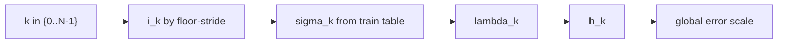

# Scheduler: simple

`simple` scheduler는 모델이 가진 이산 sigma 테이블을
별도 왜곡 없이 거의 그대로 따라가는 기준선 방식입니다.

## 0) 프레임워크 (Top-Down)

| 기호 | 타입(정의역 -> 공역) | 상태 | 의미 |
|---|---|---|---|
| $\Sigma_{\mathrm{train}}$ | $\{\sigma^{train}_0,\dots,\sigma^{train}_{T-1}\}$ | 고정 | 모델 내부 sigma 테이블 |
| `N` | $N\in\mathbb{N}$ | 고정 | 추론 step 수 |
| `S` | $\sym{Smap}{S}:\{0,\dots,N-1\}\to(0,\infty)$ | 설계 대상 | scheduler 사상 |
| `i_k` | $i_k\in\{0,\dots,T-1\}$ | 결정 | k번째로 참조할 테이블 인덱스 |
| $\sigma_k$ | $\sym{sigmak}{\sigma_k}=S(k)$ | 결정 | k번째 sigma |

대표 매핑(내림 stride):

\[
i_k=\left\lfloor k\cdot\frac{T-1}{N-1}\right\rfloor,\quad
\sigma_k=\sigma^{train}_{i_k}
\]

## 1) 제약을 단계적으로 적용

1. $N\ge 2$  
   이유: 시작/종료 경계가 있어야 역적분 경로가 정의됩니다.
2. `i_k` 단조 증가  
   이유: sigma 순서 뒤집힘 방지.
3. 중복 index 허용 정책 확인  
   이유: `N`과 `T` 비율에 따라 같은 sigma를 반복 참조할 수 있습니다.

## 2) 오차 연결

\[
h_k:=|\lambda_{k+1}-\lambda_k|,\quad
\lambda_k:=\log\alpha_k-\log\sigma_k,\quad
\|e_{\mathrm{global}}\|\approx C\max_k h_k^p
\]

`simple`은 연속 함수를 두지 않기 때문에 `h_k`가 ladder 간격에 직접 종속됩니다.

## 3) 경계 분기

| 조건 | 해석 | 결과 경향 |
|---|---|---|
| `T`가 큰 모델 | 더 촘촘한 선택 가능 | 품질 확보 유리 |
| `N`이 매우 작음 | 큰 stride 점프 | 속도↑, 안정성/디테일 손실 가능 |

## 4) 구체 예시 (원소 나열)

\[
T=8,\ N=4,\ K=\{0,1,2,3\}
\]

\[
i_0=0,\ i_1=2,\ i_2=4,\ i_3=7
\]

그래서

\[
S(0)=\sigma^{train}_0,\ S(1)=\sigma^{train}_2,\ S(2)=\sigma^{train}_4,\ S(3)=\sigma^{train}_7
\]

## 5) 의존성 그래프

## 6) Sampler 결합 관점

\[
x_{k+1}=A_kx_k+B_k\hat{x}_{0,k}+C_k(\mathrm{history})+D_k\xi_k
\]

기준선 실험에서 `simple`을 두고 다른 scheduler와 비교하면 차이를 해석하기 쉽습니다.
