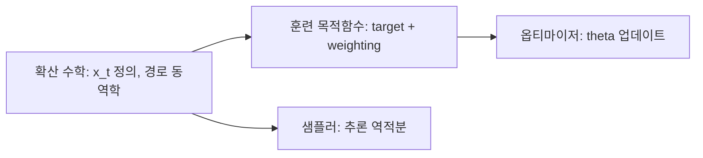

# 훈련·최적화 수학

이 섹션은 확산 공통 수학 위에서, **학습 단계에서만 필요한 수학**을 다룹니다.
즉 목적함수와 옵티마이저를 하나의 체계로 봅니다.

## 0) 상위/하위 경계

- 확산 수학: 훈련/추론 공통 기반
- 훈련·최적화 수학: 학습 시점에만 필요한 항 (`loss`, `regularization`, `optimizer`)
- 샘플러 수학: 추론 시점 항

## 1) 공통 최적화 프레임워크

| 기호 | 타입 | 의미 |
|---|---|---|
| $\theta_k$ | 파라미터 | k번째 step 파라미터 |
| $g_k$ | gradient | $g_k=\nabla_\theta \mathcal{L}(\theta_k)$ |
| $\Phi$ | 사상 | $\theta_{k+1}=\Phi(\theta_k,g_k,\text{state}_k)$ |
| $\mathcal{L}$ | 목적함수 | timestep 가중 포함 손실 |

즉 훈련 수학은
1) $\mathcal{L}$을 정의하고,
2) $\Phi$를 선택해 $\theta$를 갱신하는 문제입니다.

## 2) 문서 구성

- [목적함수](objectives.md) - $\epsilon$, $v$, FM velocity, SNR 가중
- [LoRA 수학](lora.md) - 저랭크 파라미터화
- [옵티마이저 개요](../optimizers/index.md) - AdamW/8bit/Prodigy/Muon 등 업데이트 수학

## 3) 실무 체크포인트

1. 목적함수 파라미터화($\epsilon$/$v$/velocity)와 샘플러 가정이 일치하는가.
2. 옵티마이저 변경 시 같은 seed/배치로 A/B 비교하는가.
3. 저정밀도(BF16/8bit)에서 loss spike와 grad norm을 함께 모니터링하는가.
