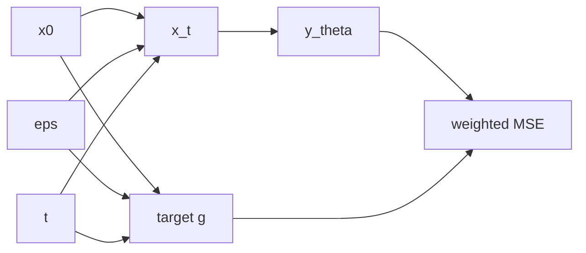

# 훈련 목적함수 (Training Objectives)

훈련 수학은 크게 두 축입니다.
1) 어떤 target을 예측할지 ($\epsilon$, $x_0$, $v$, velocity)
2) timestep별 오차를 어떻게 가중할지 ($w(t)$).

## 0) 공통 프레임워크 (Top-Down)

| 기호 | 타입/공간 | 상태 | 의미 |
|---|---|---|---|
| $x_0$ | $x_0\in\mathcal{X}$ | 임의 | 원본 데이터 |
| $\epsilon$ | $\epsilon\sim\mathcal{N}(0,I)$ | 임의 | 노이즈 샘플 |
| $t$ | $t\in\mathcal{T}$ | 임의 | 이산/연속 시간 |
| $x_t$ | $x_t\in\mathcal{X}$ | $x_0,\epsilon,t$ 고정 후 결정 | noisy 상태 |
| $y_\theta$ | $y_\theta:\mathcal{X}\times\mathcal{T}\times\mathcal{C}\to\mathcal{X}$ | 학습 대상 | 모델 출력 |
| $g$ | $g:\mathcal{X}\times\mathcal{X}\times\mathcal{T}\to\mathcal{X}$ | 설계 대상 | target 생성 사상 |
| $w$ | $w:\mathcal{T}\to\mathbb{R}_{\ge0}$ | 설계 대상 | timestep 가중치 |

공통 손실 형태:

\[
\mathcal{L}=\mathbb{E}\left[w(t)\,\|y_\theta(x_t,t,c)-g(x_0,\epsilon,t)\|_2^2\right]
\]

## 1) 대표 목적함수 4종

### 1-1) $\epsilon$-prediction

\[
\mathcal{L}_{\epsilon}=\mathbb{E}\left[\|\epsilon_\theta(x_t,t,c)-\epsilon\|_2^2\right]
\]

### 1-2) $x_0$-prediction

\[
\mathcal{L}_{x_0}=\mathbb{E}\left[\|x_{0,\theta}(x_t,t,c)-x_0\|_2^2\right]
\]

### 1-3) $v$-prediction (VP 계열)

\[
v_t=\sqrt{\bar\alpha_t}\epsilon-\sqrt{1-\bar\alpha_t}x_0
\]

\[
\mathcal{L}_{v}=\mathbb{E}\left[\|v_\theta(x_t,t,c)-v_t\|_2^2\right]
\]

### 1-4) Flow Matching velocity

\[
x_t=(1-t)x_0+t\epsilon,\quad v^*=\epsilon-x_0
\]

\[
\mathcal{L}_{FM}=\mathbb{E}\left[\|v_\theta(x_t,t,c)-v^*\|_2^2\right]
\]

## 2) 제약을 단계적으로 적용

1. $x_t$ 정의와 target 정의를 짝으로 고정
   이유: 파라미터화가 어긋나면 추론 품질이 급락합니다.
2. 학습/추론의 output type($\epsilon$/$v$/$x_0$) 일치
   이유: 샘플러가 기대하는 해석과 모델 출력 의미를 맞춰야 합니다.
3. $p(t)$와 $w(t)$의 중복 가중 방지
   이유: 특정 구간 과학습을 방지합니다.

## 3) SNR 가중치

VP:

\[
\operatorname{SNR}(t)=\frac{\bar\alpha_t}{1-\bar\alpha_t}
\]

FM:

\[
\operatorname{SNR}_{FM}(t)=\left(\frac{1-t}{t}\right)^2
\]

Min-SNR-$\gamma$ 대표형:

\[
w_{\mathrm{min\mbox{-}snr}}(t)=\frac{\min(\operatorname{SNR}(t),\gamma)}{\operatorname{SNR}(t)}
\]

의미: 고 SNR 구간의 그래디언트 지배를 완화해 전 구간 균형을 맞춥니다.

## 4) 분기 기준 (무엇을 고를지)

| 조건 | 추천 |
|---|---|
| SD1.x/DDPM 재현 | $\epsilon$-prediction |
| SDXL/고해상도 안정화 | $v$-prediction + Min-SNR |
| Flow/Rectified-Flow 계열 | FM velocity |

## 5) 구체 예시 (원소 나열)

$x_0=(1,0)$, $\epsilon=(0,2)$, $\bar\alpha_t=0.81$이면

\[
x_t=\sqrt{0.81}(1,0)+\sqrt{0.19}(0,2)=(0.9,0.8718\ldots)
\]

\[
v_t=\sqrt{0.81}(0,2)-\sqrt{0.19}(1,0)=(-0.4359\ldots,1.8)
\]

같은 $x_t$를 써도 target 정의($\epsilon$, $x_0$, $v$)가 달라지면 훈련 신호가 달라집니다.

## 6) 구현 체크리스트

1. $model\_pred\_type$과 target 생성 코드가 일치하는가.
2. 가중치 $w(t)$ 적용 위치(리덕션 전/후)가 일관적인가.
3. loss 스케일 로그를 timestep bin별로 모니터링하는가.
