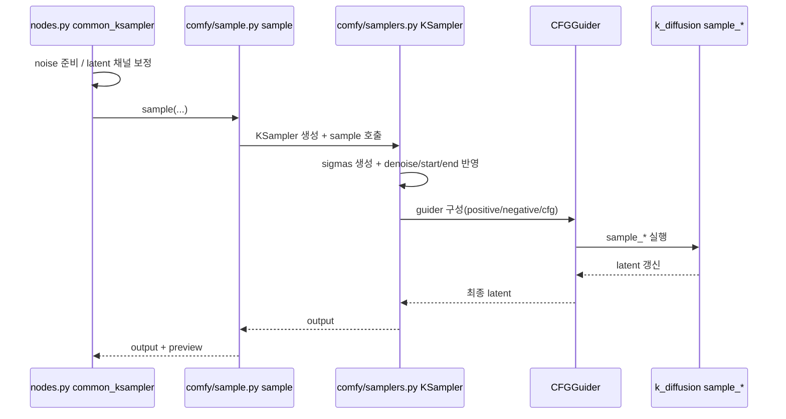

# ComfyUI 샘플러 구현

<span class="version-badge">ComfyUI v0.14.2</span>
<span class="version-badge">comfy/samplers.py</span>
<span class="version-badge">comfy/k_diffusion/sampling.py</span>

이 페이지는 ComfyUI 샘플러를
"UI 노드"가 아니라
"수치적분 엔진"으로 해석합니다.

## 1) 실행 체인 (코드 레이어)



핵심:
- `KSampler`는 오케스트레이터.
- 실제 적분기는 `k_diffusion/sampling.py::sample_*`.
- CFG/cond/inpaint는 `CFGGuider`와 wrapper에서 결합.

## 2) 핵심 파라미터의 실제 의미

| UI 파라미터 | 내부 의미 | 수식 관점 |
|---|---|---|
| `steps` | sigma 격자 길이 결정 | 적분 분할 수 `N` |
| `sampler_name` | `sample_*` 함수 선택 | 적분기 종류(Euler/Heun/Multistep/SDE) |
| `scheduler` | sigma mesh 생성 방식 | 시간 재매개화 $\sigma_k$ |
| `cfg` | cond/uncond 결합 강도 | `u + s(c-u)`의 `s` |
| `denoise` | sigma tail slice | 적분 구간 길이 단축 |
| `start_step`, `last_step` | 구간 컷 | 부분 궤적 적분 |

## 3) 코드 ↔ 수식 매핑

ComfyUI 공통 커널:

\[
d(x,\sigma)=\frac{x-\hat{x}_0}{\sigma}
\]

\[
x_{k+1}=x_k+d_k\cdot(\sigma_{k+1}-\hat{\sigma}_k)+\text{(noise/correction)}
\]

| 코드 요소 | 수식 항 | 역할 |
|---|---|---|
| `denoised = model(x, sigma, ...)` | $\hat{x}_0$ 또는 동치 파라미터화 | 모델 추정 |
| `to_d(x, sigma, denoised)` | $d(x,\sigma)$ | 드리프트 벡터장 근사 |
| `sigmas[k], sigmas[k+1]` | $\Delta\sigma_k$ | step 크기 |
| `noise_sampler` | $\xi_k\sim\mathcal{N}(0,I)$ | 확률항 |

## 4) 샘플러 패밀리 해석

| 분류 | 대표 | 해석 |
|---|---|---|
| 결정론 ODE | `euler`, `heun`, `dpmpp_2m`, `lms` | noise 재주입 없이 궤적 적분 |
| 확률론 SDE/ancestral | `euler_ancestral`, `dpmpp_sde`, `seeds_*`, `sa_solver*` | drift + 확률항 동시 적분 |
| CFG++ | `*_cfg_pp` | CFG 결합식을 별도 보정 |
| 적응 스텝 | `dpm_adaptive` | 오차 추정으로 step 크기 자동 조절 |

## 5) 수학 관점 요약

### 5-1) ODE/SDE

역시간 SDE(개략):

\[
dX_t=b_t(X_t)\,dt+g_t\,d\bar{W}_t
\]

확률흐름 ODE(개략):

\[
\frac{dX_t}{dt}=v_t(X_t)
\]

- 결정론 샘플러: ODE 근사
- ancestral/SDE 샘플러: 확률항 포함 근사

### 5-2) FPE 관점

\[
\partial_t\rho_t
=
-\nabla\cdot(\rho_t b_t)
+\frac12 g_t^2\Delta\rho_t
\]

- `to_d`/CFG는 drift(`b_t`)를 바꿈
- `eta`, `s_noise`는 diffusion 세기를 바꿈

### 5-3) OT 관점

결정론 경로는 연속방정식:

\[
\partial_t\rho_t+\nabla\cdot(\rho_t v_t)=0
\]

동적 OT(Benamou-Brenier) 해석:

\[
\min\int_0^1\int\frac12\|v_t(x)\|^2\rho_t(x)\,dx\,dt
\]

직관:
- scheduler는 "어디를 촘촘히 적분할지"를 정하고,
- cfg는 벡터장을 외삽하여 경로 에너지를 바꿉니다.

## 6) `sample_euler` 예시

```python
@torch.no_grad()
def sample_euler(model, x, sigmas, extra_args=None, callback=None,
                 disable=None, s_churn=0., s_tmin=0., s_tmax=float('inf'),
                 s_noise=1.):
    extra_args = {} if extra_args is None else extra_args
    s_in = x.new_ones([x.shape[0]])
    for i in trange(len(sigmas) - 1, disable=disable):
        gamma = min(s_churn / (len(sigmas) - 1), 2**0.5 - 1) \
                if s_tmin <= sigmas[i] <= s_tmax else 0.
        sigma_hat = sigmas[i] * (gamma + 1)
        if gamma > 0:
            eps = torch.randn_like(x) * s_noise
            x = x + eps * (sigma_hat**2 - sigmas[i]**2)**0.5
        denoised = model(x, sigma_hat * s_in, **extra_args)
        d = to_d(x, sigma_hat, denoised)  # d=(x-denoised)/sigma
        dt = sigmas[i + 1] - sigma_hat
        x = x + d * dt
    return x
```

이론 참조: [Euler](../../theory/samplers/sampler/euler.md)

## 7) Custom Sampling 노드를 써야 하는 경우

기본 `KSampler`는 간단하지만, 아래 경우엔 `SamplerCustom*`가 유리합니다.

1. `eta`, `s_noise`, `order`, `rtol/atol` 등 solver 내부 파라미터를 직접 제어할 때
2. sigma를 수동 편집(`ManualSigmas`, `SplitSigmas`, `FlipSigmas`)할 때
3. 같은 sigma에서 solver만 교체해 실험할 때

## 8) 재현 구현 체크리스트

1. `fix_empty_latent_channels`로 latent shape 보정.
2. `prepare_noise(seed, batch_index)` 규칙 재현.
3. `calculate_sigmas + denoise slicing + start/last_step` 순서 일치.
4. `process_conds`(특히 `start_percent/end_percent`) 재현.
5. inpaint면 `KSamplerX0Inpaint` 동등 로직 포함.

## 9) 자주 틀리는 지점

1. `denoise`를 단순 스케일로 오해: 실제론 sigma tail slice입니다.
2. `KSampler`만으로 고급 튜닝 가능하다고 착각: solver 세부 파라미터는 `Custom Sampling`이 필요합니다.
3. model sampling 타입(`EPS`, `V_PREDICTION`, `CONST` 등)을 무시: 같은 sampler라도 체감 동작이 달라집니다.

