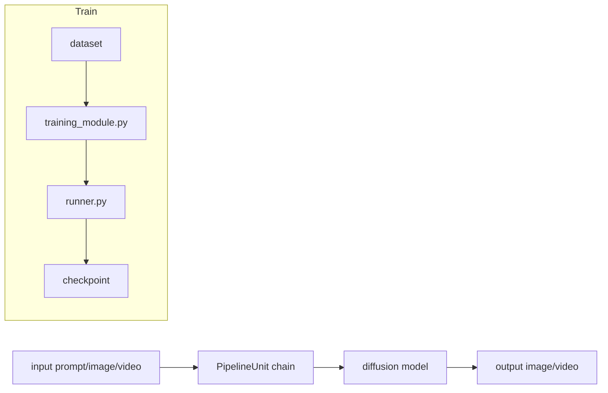

# DiffSynth-Studio

DiffSynth-Studio

!!! quote "분석 기준 소스"
    **리포지토리**: [modelscope/DiffSynth-Studio](https://github.com/modelscope/DiffSynth-Studio)  
    **로컬 경로**: `Reference/DiffSynth-Studio/`

통합 파이프라인. 이미지 + 비디오 생성/훈련 지원.

## 1) 구조 개요

핵심:
- 추론은 `PipelineUnit` 체인 중심
- 학습은 `training_module.py` + `runner.py` 중심

## 2) 코드 맵 (로컬 기준)

| 영역 | 파일 | 의미 |
|---|---|---|
| 학습 모듈 | `diffsynth/diffusion/training_module.py` | 학습 로직 구성 |
| 러너 | `diffsynth/diffusion/runner.py` | step/epoch 실행 제어 |
| 파이프라인(이미지) | `diffsynth/pipelines/flux_image.py`, `flux2_image.py`, `qwen_image.py`, `z_image.py` | 모델별 추론 경로 |
| 파이프라인(비디오) | `diffsynth/pipelines/wan_video.py` | 비디오 생성 경로 |

## 3) 도구 성격

| 항목 | DiffSynth-Studio 특징 |
|---|---|
| 범위 | 추론 + 학습을 한 리포지토리에서 통합 |
| 데이터 타입 | 이미지/비디오 양쪽 지원 |
| 학습 모드 | SFT, distillation, LoRA 중심 워크플로 제공 |
| 파이프라인 | 모델별 전용 pipeline 클래스로 확장 |

## 4) 다른 도구와 비교

| 도구 | 강점 | 적합 시나리오 |
|---|---|---|
| DiffSynth-Studio | 멀티모달 통합(이미지+비디오) | 모델 연구/통합 실험 |
| [kohya](../kohya/index.md) | CLI 기반 실전 LoRA 워크플로 | SD/SDXL/Flux 실전 학습 |
| [diffusion-pipe](../diffusion-pipe/index.md) | 고효율 분산/파이프라인 학습 | 대형 모델 Full FT |

## 5) 실무 체크리스트

1. 사용 pipeline과 모델 가중치 포맷이 정확히 맞는가.
2. 비디오 모델에서 프레임 수/해상도 버킷을 먼저 고정했는가.
3. distillation 사용 시 teacher/student 출력 계약을 동일하게 맞췄는가.
4. 저장 포맷을 타 런타임(ComfyUI 등)으로 내보낼 때 키 매핑을 검증했는가.
