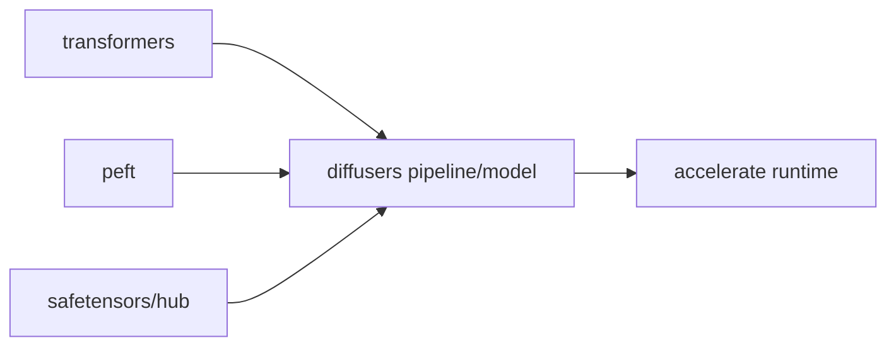
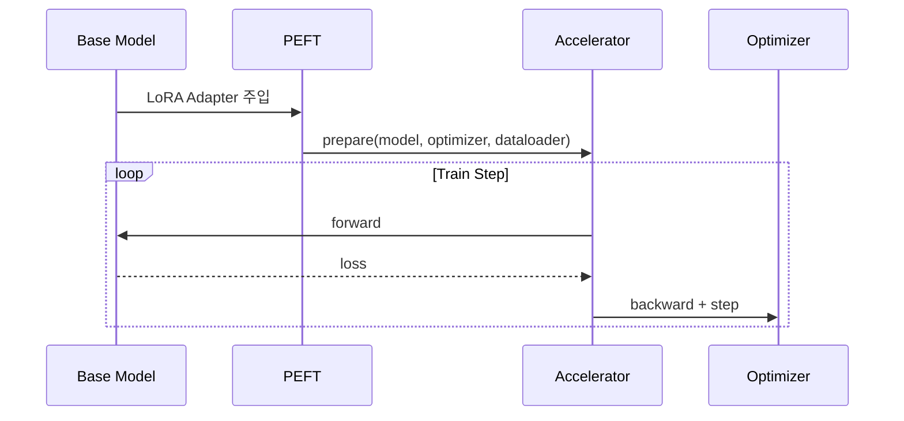

# HuggingFace

diffusers, PEFT, Accelerate, transformers 생태계 분석.

diffusers v{{ ver.diffusers }}
transformers v{{ ver.transformers }}

## 1) 생태계 역할 분해

| 라이브러리 | 핵심 역할 | 이 프로젝트 관점 |
|---|---|---|
| `transformers` | 텍스트 인코더/LLM 구현 | CLIP/T5/Qwen 계열 인코더 기반 |
| `diffusers` | 확산 파이프라인/스케줄러 추상화 | 모델 로딩/샘플러 실험의 기준 API |
| `accelerate` | 분산/혼합정밀/런타임 | 학습 루프 실행 인프라 |
| `peft` | LoRA/adapter 주입 | 경량 미세조정 표준 인터페이스 |

## 2) 추상 API 관점

| 층 | 대표 객체 | 의미 |
|---|---|---|
| 모델 층 | `UNet2DConditionModel`, `Transformer2DModel` 등 | 파라미터화된 예측기 |
| 스케줄 층 | `DDIMScheduler`, `Euler*Scheduler` 등 | timestep/sigma 규약 |
| 파이프라인 층 | `StableDiffusionPipeline` 계열 | 구성요소 orchestration |
| 런타임 층 | `Accelerator` | device/distributed/mixed precision |

## 3) LoRA 학습의 표준 흐름

핵심:
- base weight는 고정하고 adapter만 학습하는 패턴이 기본
- 저장은 보통 adapter 분리 저장(재사용/병합 용이)

## 4) 다른 도구와의 관계

| 도구 | 관계 | 실무 포인트 |
|---|---|---|
| [kohya](../kohya/index.md) | HF 생태계 일부를 래핑/확장 | CLI 중심 실전 워크플로 |
| [diffusion-pipe](../diffusion-pipe/index.md) | 고효율 학습 엔진 + 자체 파이프라인 | 대형 모델 FT에 유리 |
| [ComfyUI](../comfyui/index.md) | 추론 그래프 런타임 | HF 가중치와 포맷 호환 중요 |

## 5) 구현 체크리스트

1. scheduler의 `prediction_type`과 모델 학습 target(`epsilon/v/x0`)이 일치하는가.
2. PEFT adapter key 이름이 타 런타임(ComfyUI 등)과 호환되는가.
3. `accelerate` 설정(`mixed_precision`, gradient accumulation)이 하드웨어와 맞는가.
4. safetensors 저장 시 dtype/키 prefix를 명시적으로 검증하는가.
