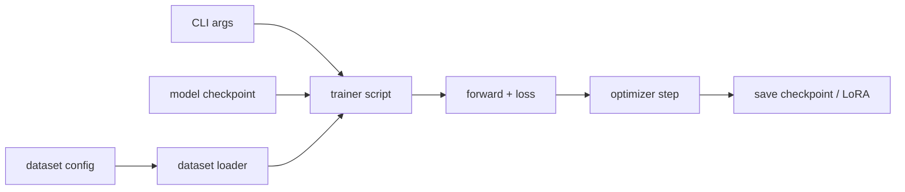

# kohya (sd-scripts)

<span class="version-badge">sd-scripts v0.10.1</span>

!!! quote "분석 기준 소스"
    **리포지토리**: [kohya-ss/sd-scripts](https://github.com/kohya-ss/sd-scripts)  
    **분석 버전**: `0.10.1`  
    **로컬 경로**: `Reference/sd-scripts-0.10.1/sd-scripts-0.10.1/`

CLI 기반 훈련 스크립트. LoRA, DreamBooth, Full Fine-tune을 지원.

## 1) 구조 개요



핵심:
- 진입점은 스크립트 단위(`*_train.py`, `*_train_network.py`)
- 공통 유틸은 `library/*.py`에 모여 있음

## 2) 주요 스크립트 맵

| 목적 | 스크립트 | 비고 |
|---|---|---|
| 범용 LoRA 학습 | `train_network.py` | SD 계열 공통 진입점 |
| SDXL LoRA/학습 | `sdxl_train_network.py`, `sdxl_train.py` | SDXL 전용 경로 |
| SD3 LoRA/학습 | `sd3_train_network.py`, `sd3_train.py` | MMDiT + 복합 TE |
| FLUX LoRA/학습 | `flux_train_network.py`, `flux_train.py` | Flow Matching 계열 |
| Anima 학습 | `anima_train_network.py` | Anima 전용 학습 경로 |

관련 공통 모듈:
- `library/train_util.py`
- `library/custom_train_functions.py`
- `library/strategy_*.py`

## 3) 이론과 코드의 연결

| 이론 항목 | 대표 코드 위치 | 설명 |
|---|---|---|
| 정방향 노이즈 추가 | `library/train_util.py` | `x_t` 생성 |
| 목적함수/가중치 | `library/custom_train_functions.py` | Min-SNR 등 |
| 모델별 timestep 전략 | `library/strategy_flux.py`, `strategy_sd3.py`, `strategy_sdxl.py` | 모델별 분기 |
| LoRA 주입/저장 | `networks/*`, `train_network.py` | rank/alpha 및 저장 |

## 4) 자주 쓰는 옵션 그룹

| 그룹 | 대표 옵션 | 의미 |
|---|---|---|
| 학습 기본 | `--learning_rate`, `--optimizer_type`, `--max_train_steps` | 기본 학습 제어 |
| LoRA | `--network_module`, `--network_dim`, `--network_alpha` | LoRA 용량/스케일 |
| 메모리 | `--gradient_checkpointing`, `--mixed_precision`, `--blocks_to_swap` | VRAM 절약 |
| 로깅/저장 | `--output_dir`, `--save_every_n_steps` | 실험 재현성 |

## 5) 최소 실행 예시 (Windows PowerShell)

```powershell
cd .\Reference\sd-scripts-0.10.1\sd-scripts-0.10.1

accelerate launch train_network.py `
  --network_module=networks.lora `
  --network_dim=16 `
  --network_alpha=8 `
  --optimizer_type=AdamW `
  --learning_rate=1e-4 `
  --output_dir=.\output
```

## 6) 장단점

| 항목 | 강점 | 한계 |
|---|---|---|
| 스크립트 생태계 | 매우 넓은 모델 지원, 레퍼런스 풍부 | 옵션 조합 복잡 |
| 실전성 | LoRA/DreamBooth 워크플로가 성숙 | 설정 파일/파이프라인 표준화는 약함 |
| 확장성 | 커스텀 옵션 추가가 빠름 | 코드 경로가 모델별로 분산 |

## 7) 관련 문서

- 수학: [훈련 목적함수](../../theory/training/objectives.md), [Flow Matching](../../theory/diffusion/flow-matching.md)
- 모델: [SDXL](../../models/sdxl_arch.md), [SD3](../../models/sd3_arch.md), [FLUX](../../models/flux_arch.md), [Anima](../../models/anima.md)
